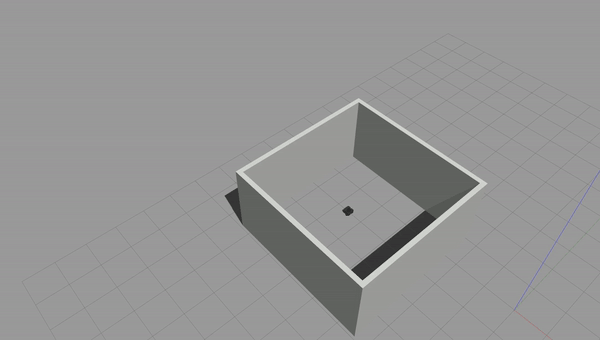
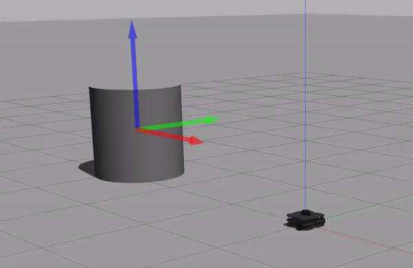

# warmup_project

# Drive Square

<p align="center">
  
</p>


## Objective
 The task is to make the  bot drive in a square path. This would be really simple if the bot could move sideways as well as forward/backward. However, with the limitation of moving solely in the x axis, my approach was to control the z angular speed. Since we cannot directly just tell the bot to turn 90 degrees, there was some computation to create that as a process for the robot:

1. The bot understands radians. So the actual “angle” we will be feeding into the algorithm is (90 degrees * 2 * pi / 360)
2. Additionally, the speed at which the bot moves can increase the drift of the bot and offset the angle because the bot must decelerate before moving forward again. 

Heres a diagram showing the basic steps that my approach suggests:


<p align="center">
  
</p>


## Code Structure

Because this was a pretty simple program, I did not write any functions for it. All my code exists within the run function. Here are the important factors:

- **`curTime`**: because I did not see/know of a function that can act as a timer, as opposed to reflecting the computer's clock, I created a timer of my own. Every time the program is ran, curTime is what keeps track of how much time passes.  Each time it grabs the active time using `rospy.Time.now().to_sec()` and subtracts the **`startTime`**, which stores another `rospy.Time.now().to_sec()` generated at the beginning of the program.

- **`current_angle`** & **`relative_angle`**: this was done with a lot of help from the [turtlesim wiki](http://wiki.ros.org/turtlesim/Tutorials/Rotating%20Left%20and%20Right "turtlesim wiki"). Essentially, this while loop keeps running until **`current_angle`**, which starts from 0, catches up to the relative_angle of 1.571. In the meantime, the bot spins with angular velocity in the z axis, aligning itself to a 90 degree angle of a square.

Overall, for 10 seconds controlled by **`curTime`**, bot moves forward. Then, the x linear velocity is set to 0, it does a ~90 degree turn, and z axis angular velocity is set to 0. Then the run loop resets and the turtle repeats the two steps. It draws squares indefinitely. 

# Wall Follower

<p align="center">
  
</p>


## Objective

The task is to make the bot navigate close to a wall and drive alongisde the wall at a fixed distance, handling corners. Here is the procedure I created:
 
 1. Make the bot proceed forward until it nears 0.5 away from the wall.
 2. Scan either side for closest wall obstacles. Mark that as the direction of the turn.
 3. Use angular velocity z to turn towards that wall obstacle. 
 Repeat


## Code Structure

All my code was written within the process_scan() function, which utilizes the Laser Scan. Within it my code functions within three phases:

- **`Phase 0`**: keep going until the bot nears a wall.

- **`Phase 1`**: At neared wall, scan either side and decide which is closer. 

- **`Phase 2`**: Turn bot to face that side.

# Person Follower

<p align="center">
  
</p>


## Objective
 The task is to make the  bot find the closest object and approach it without bumping into it. This would be very simple if the bot could identify the closest object on its own and just drive in that direction. However, there is no immediate way to identify the closest object. Here is the procedure I created:
 
 1. Go through Laser Scan range array and find the closest object that does not exceed the distance boundaries (we don't want to be running into things that are too close).
 2. Rotate the bot to face the object using angular z velocity, similar to Drive Square.
 3. Set x velocity and appraoch the object until the bot is within a safe distance.


## Code Structure

All my code was written within the process_scan() function, which utilizes the Laser Scan. Within it my code functions within three phases:

- **`Phase 0`**: identify the closest object using laser scan. The distance boundary for the closest object is set to 0.5, so if any object is closer than that, then it will be ignored by the bot. Once the object is found, the array index is saved, the angle is calculated by converting to radians, and phase 1 is activated. If no object is found, then the bot simply waits.

- **`Phase 1`**: turns the bot to face the object. Using the angle from phase 0, the bot turns until it hits the boundary. Then, the z velocity is set to 0, x velocity is set to 0.5, and phase 2 is activated.

- **`Phase 2`**: this moves the bot forward until it is within 0.5 of the object approaching. Then it stops, and goes back to phase 0. It will only move forward once a new object is identified within a safe range.


## Overcome Challenges and Takeaways


### Drive Square 

As this was my first ROS project, there was a lot to learn! My biggest issues came from working with rosbag. For whatever reason, it seemed to not be functioning properly and not picking up on any topic output messages. Additionally, it created humongous files that were super hard to parse through to find issues on. Pouya MG, our class TA, was essential to helping me clarify what was going on. 

Here is a helpful command that can help narrow down problems:

```bash
rosbag info [bag-name].bag
```

This helps identify what is in your bag! You should see a bunch of stuff that looks like this:

<p align="center">
  
</p>


If you just see two lines like this, then your bag is being corrupted:

<p align="center">
  
</p>


Here's a picture overview and a protocol for tackling rosbag issues later on:

<p align="center">
  
</p>

Steps:

- [Terminal 1] Launch **`roscore`**
- [Terminal 2] Launch rosbag (replace cmd_vel with other topics you are tracking):

```bash
rosbag record -j -O drive_square.bag /cmd_vel
```

- [Terminal 3] Launch roslaunch (replace warmup_project with your directory and turtlebot3_in_room.launch with another launch file):

```bash
roslaunch warmup_project turtlebot3_in_room.launch
```

- [Terminal 4] Launch rosrun (replace warmup_project with your directory and include your own python file):

```bash
rosrun warmup_project drive_square.py
```

- [Terminal 5] Launch rosnode! This is necessary in case your rosbag doesn't terminate on its own. Rosnode allows you to see a list of active nodes and then kill the rosbag once you're done recording your process:

```bash
rosnode list
rosnode kill rosbag_node_name
```

- [Terminal 6] Launch rostopic echo! This is helpful to see if your topics are actually printing information. In case your rosbag turns up empty upon compiling, you can disqualify your topics as the issue and find what else is up.

```bash
rostopic echo /cmd_vel
```

### Wall Follower

This gave me a lot of trouble because I could not find a good way to detect corners that were not right angles. My bot can only navigate right angle obstacles because it cannot turn beyond a certain range without falling off course. This allows it to perfectly function within the square walls but in more complex conditions it does not fit the parameters.

### Person Follower

This project gave me a lot of trouble because I could not find a way to dynamically make the object tracking happen. Because of the static state of my steps, my bot could track down one object, then wait around for a new object to move. However, on its own, it could not accomodate dynamically changing tracking objects. In fact, this would make the bot go out of bounds. One issue I did overcome was fixing the angular velocity of the bot to not miss the target. For instance, I started out with an angular z velocity of 0.5. However, this would make the bot actually turn too quickly and miss the target. I learned that if I adjusted it to a smaller number of 0.2, it would make the target. 

Another lesson I learned was keeping a track of good conditions. I ran into an issue where my bot would keep spinning and trying to find new targets, and I realized that it was because I did not have a condition that would stop searching if any close objects exceeded the distance parameter. For example, if my object had to stop within 0.5 of any object, and my algorithm simply found the closest object, the bot would keep spinning. My adding this into the Phase 0 check, I was able to solve this issue.

## Future Steps

### Drive Square 

With more time, I would definitely work on other libraries like scan to minimize drift. At the moment, although the bot is set to turn 90 degrees, with drift, it turns slightly less than it should which makes the path look lopsided. I experimented with different values, like turning 91-95 degrees. However, those values made the bot evidently overshoot over time. I believe that working with the scan topic, the bot could scan for walls and make sure there's a standardized distance and degree to the obstacles around it. This could help it reset to go in a more straight path.

### Wall Follower

With more time, I would work on making it function with variable corner angles. It would also be very interesting to see it detect differences between inner and outer corners. Because we were only expected to have a working both within an enclosed space, we do not need to worry about open world conditions, which I believe would be interesting to explore.

### Person Follower

With more time, I would definitely work on making this a dynamically changing bot that could pick up changes in the environment and recaliberate to appraoch closer object. At the moment, the bot is only able to look for a new target once it goes through the three phases outlined. 


