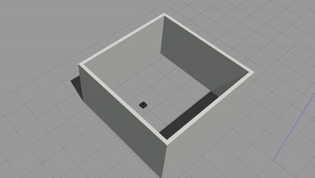
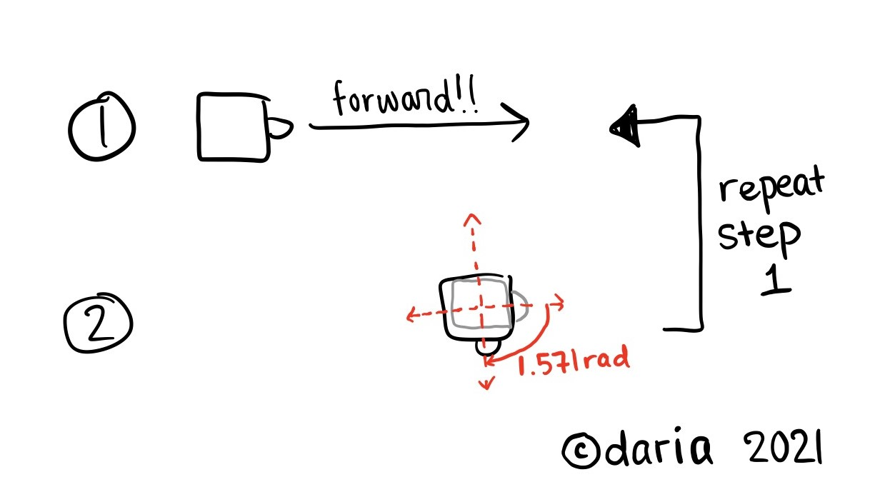
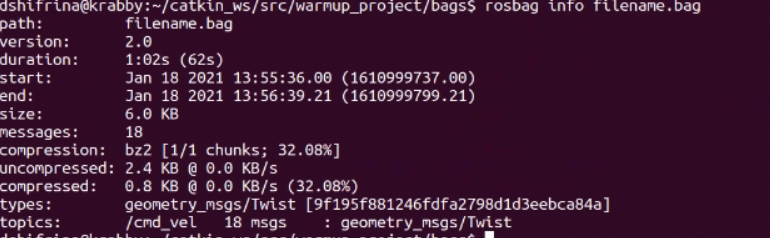
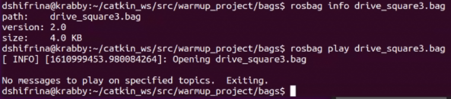
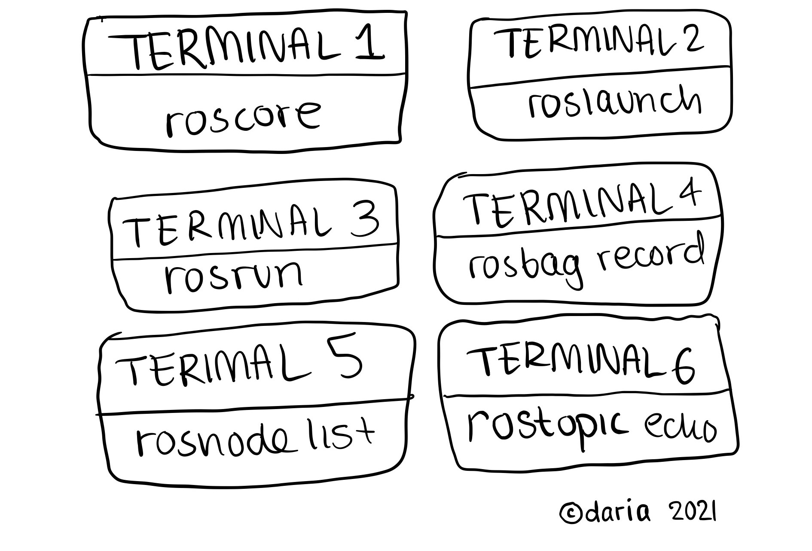

# warmup_project

# Drive Square

<p align="center">
  
</p>


## Objective
 The task is to make the  bot drive in a square path. This would be really simple if the bot could move sideways as well as forward/backward. However, with the limitation of moving solely in the x axis, my approach was to control the z angular speed. Since we cannot directly just tell the bot to turn 90 degrees, there was some computation to create that as a process for the robot:

1. The bot understands radians. So the actual “angle” we will be feeding into the algorithm is (90 degrees * 2 * pi / 360)
2. Additionally, the speed at which the bot moves can increase the drift of the bot and offset the angle because the bot must decelerate before moving forward again. 

Heres a diagram showing the basic steps that my approach suggests:


<p align="center">
  
</p>


## Code Structure

Because this was a pretty simple program, I did not write any functions for it. All my code exists within the run function. Here are the important factors:

- **`curTime`**: because I did not see/know of a function that can act as a timer, as opposed to reflecting the computer's clock, I created a timer of my own. Every time the program is ran, curTime is what keeps track of how much time passes.  Each time it grabs the active time using `rospy.Time.now().to_sec()` and subtracts the **`startTime`**, which stores another `rospy.Time.now().to_sec()` generated at the beginning of the program.

- **`current_angle`** & **`relative_angle`**: this was done with a lot of help from the [turtlesim wiki](http://wiki.ros.org/turtlesim/Tutorials/Rotating%20Left%20and%20Right "turtlesim wiki"). Essentially, this while loop keeps running until **`current_angle`**, which starts from 0, catches up to the relative_angle of 1.571. In the meantime, the bot spins with angular velocity in the z axis, aligning itself to a 90 degree angle of a square.

Overall, for 10 seconds controlled by **`curTime`**, bot moves forward. Then, the x linear velocity is set to 0, it does a ~90 degree turn, and z axis angular velocity is set to 0. Then the run loop resets and the turtle repeats the two steps. It draws squares indefinitely. 

## Overcome Challenges and Takeaways

As this was my first ROS project, there was a lot to learn! My biggest issues came from working with rosbag. For whatever reason, it seemed to not be functioning properly and not picking up on any topic output messages. Additionally, it created humongous files that were super hard to parse through to find issues on. Pouya MG, our class TA, was essential to helping me clarify what was going on. 

Here is a helpful command that can help narrow down problems:

```bash
rosbag info [bag-name].bag
```

This helps identify what is in your bag! You should see a bunch of stuff that looks like this:

<p align="center">
  
</p>


If you just see two lines like this, then your bag is being corrupted:

<p align="center">
  
</p>


Here's a picture overview and a protocol for tackling rosbag issues later on:

<p align="center">
  
</p>

Steps:

- [Terminal 1] Launch **`roscore`**
- [Terminal 2] Launch rosbag (replace cmd_vel with other topics you are tracking):

```bash
rosbag record -j -O drive_square.bag /cmd_vel
```

- [Terminal 3] Launch roslaunch (replace warmup_project with your directory and turtlebot3_in_room.launch with another launch file):

```bash
roslaunch warmup_project turtlebot3_in_room.launch
```

- [Terminal 4] Launch rosrun (replace warmup_project with your directory and include your own python file):

```bash
rosrun warmup_project drive_square.py
```

- [Terminal 5] Launch rosnode! This is necessary in case your rosbag doesn't terminate on its own. Rosnode allows you to see a list of active nodes and then kill the rosbag once you're done recording your process:

```bash
rosnode list
rosnode kill rosbag_node_name
```

- [Terminal 6] Launch rostopic echo! This is helpful to see if your topics are actually printing information. In case your rosbag turns up empty upon compiling, you can disqualify your topics as the issue and find what else is up.

```bash
rostopic echo /cmd_vel
```

## Future Steps

With more time, I would definitely work on other libraries like scan to minimize drift. At the moment, although the bot is set to turn 90 degrees, with drift, it turns slightly less than it should which makes the path look lopsided. I experimented with different values, like turning 91-95 degrees. However, those values made the bot evidently overshoot over time. I believe that working with the scan topic, the bot could scan for walls and make sure there's a standardized distance and degree to the obstacles around it. This could help it reset to go in a more straight path.


